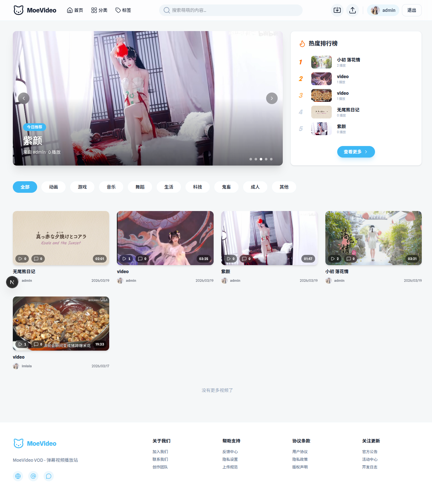
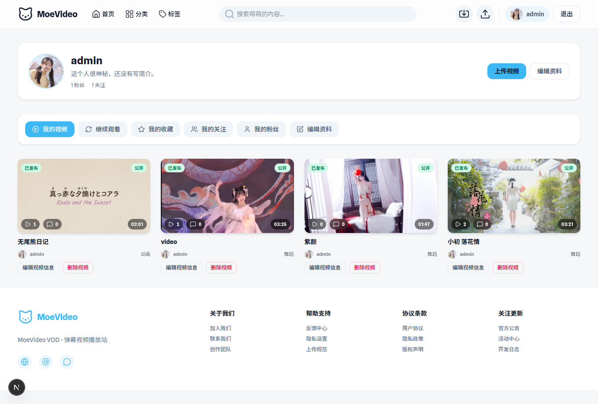
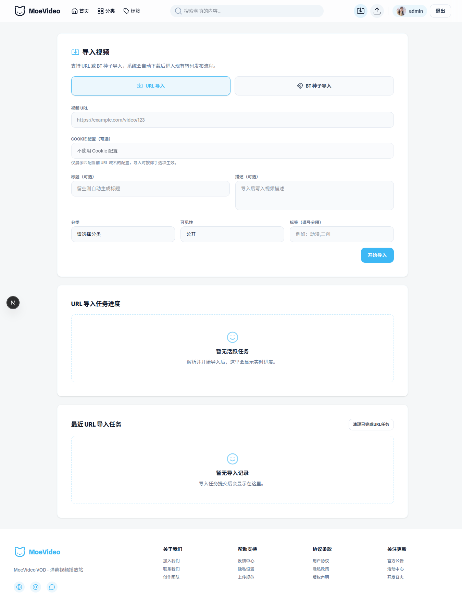
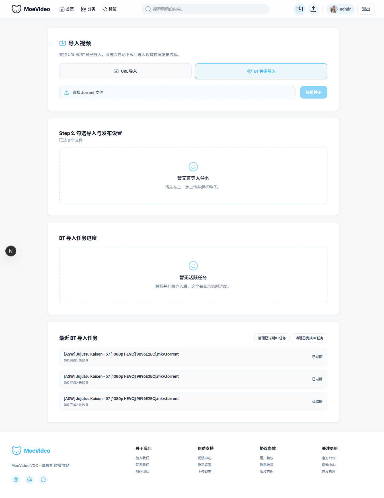
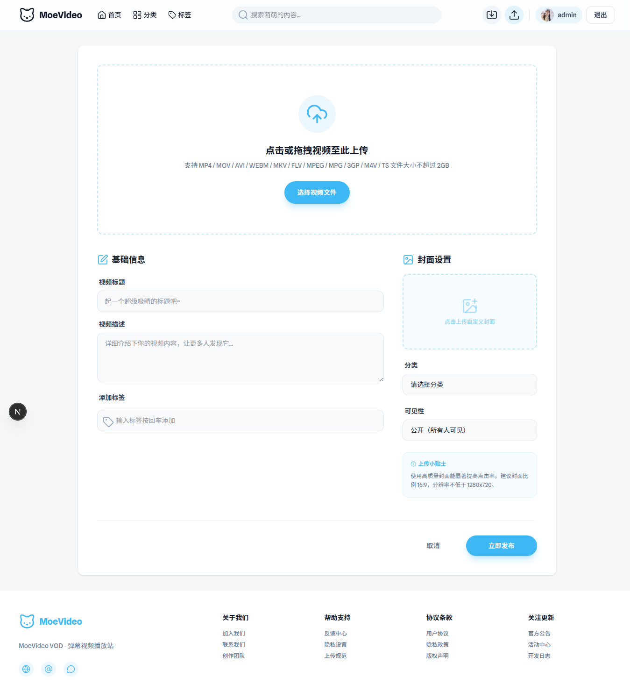

# MoeVideo

开源弹幕视频播放站点（支持BitTorrent / yt-dlp + curl-cffi / rebrowser-playwright + chromium导入视频）

功能：

- 视频上传
- BT导入视频：支持自动解析种子文件内的媒体文件。
- URL导入视频：yt-dlp + curl-cffi
- 自定义yt-dlp cookies（cookies采用加密存储并支持配置多个站点）
- 回落支持：yt-dlp不支持的站点自动回落到rebrowser-playwright + chromium
- 强制回落：通过环境变量配置指定域名直接走rebrowser-playwright + chromium
- HLS多码率转码：360p 480p 720p 1080p
- 用户中心：可设置头像，签名，个人信息隐私策略等
- 多用户支持：可选开启或关闭注册
- 互动系统：点赞 评论 收藏 粉丝关注
- 视频弹幕支持 （WebSocket）
- ArtPlayer 雪碧图 + VTT
- 跨设备同步播放记录，记忆上次播放位置。
- 完善的管理面板：站点设置 用户管理 视频管理 转码任务管理 分类设置 yt-dlp设置 等
- 本地存储 / S3存储支持
- 更多功能请部署后体验...

回落探测媒体下载链接的实现逻辑：

yt-dlp支持的站点直接走yt-dlp下载，yt-dlp如提示不支持，则走rebrowser-playwright + chromium探测页面的媒体链接，供用户手动选择下载。用户也可以设置指定域名直接走rebrowser-playwright + chromium。

技术栈：

- Frontend: Next.js App Router + Tailwind CSS（`frontend/`）
- Backend: Go + Fiber + SQLite WAL（`backend/`）
- Storage: local（默认）/ s3
- Tooling: bun + mise
- Transcode: ffmpeg/ffprobe

项目截图：

     

## Quick Start

```bash
mise install
mise trust
```

### Backend

```bash
cp backend/.env.example backend/.env
# 必须先在 backend/.env 里替换 JWT_SECRET（不能使用默认占位值）
mise run backend-dev
```

Backend 默认地址：`http://localhost:8080`
后端程序会自动读取 `backend/.env`（同名系统环境变量优先，不会被 `.env` 覆盖）。

若要启用 URL 导入的页面解析 fallback（Playwright）：

```bash
cd backend/scripts
bun install
bunx playwright install chromium
```

说明：项目通过 npm alias 使用 `rebrowser-playwright@1.52.0`（包名保持 `playwright`）。

创建管理员账号：

```bash
cd backend
go run ./cmd/admin bootstrap --email admin@example.com --username admin --password your-password
```

### Frontend

```bash
cp frontend/.env.example frontend/.env.local
mise run frontend-install
mise run frontend-dev
```

Frontend 默认地址：`http://localhost:3000`
后台入口：`http://localhost:3000/admin/login`

## Verify

```bash
mise run backend-test
```

## API & Schema

- API 文档：`backend/docs/api.md`
- 数据库文档：`backend/docs/schema.md`
- yt-dlp 参数配置文档：`backend/docs/ytdlp-settings.md`
- yt-dlp 用户 Cookies 使用文档：`backend/docs/ytdlp-user-cookies.md`
- Debian 13 部署文档：`docs/deploy-production-debian13.md`
- Docker Compose 部署文档（含宿主机 Nginx、同域/分域配置，支持本地 build 与 GHCR 拉取 `amd64/arm64`，支持前端 API 运行时变量注入）：`docs/deploy-production-docker-compose.md`

